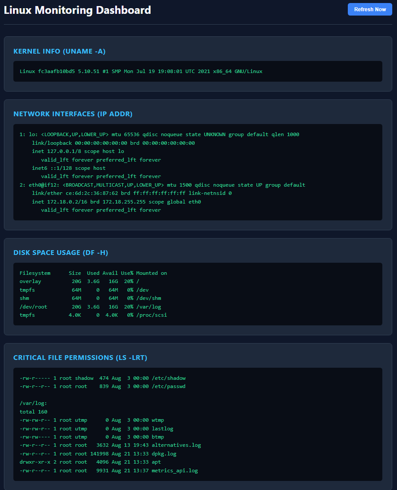

# Linux Monitoring App

A small monitoring stack that collects system metrics and serves a lightweight dashboard. 
Technologies used: Python (API backend, built with FastAPI and served via Uvicorn) and Nginx (static frontend); services are containerised with Docker and orchestrated via Docker Compose.


**Screenshots**

System Dashboard



List of currently running containers 


List of images


List of networks


List of volumes


**Project Structure**

```
linux-monitoring-app/
├── docker-compose.yaml
├── readme.md
├── assets/
├── metrics-collector/
│   ├── app.py
│   ├── Dockerfile
│   └── requirements.txt
└── system-dashboard/
    ├── Dockerfile
    ├── index.html
    └── nginx.conf
```

**Overview**
- `metrics-collector`: Python collector service that gathers system metrics and runs as the backend.
- `system-dashboard`: Static dashboard served by Nginx (frontend).
- `docker-compose.yaml`: Orchestrates the services, networks, and volumes.

**Prerequisites**
- Docker
- Docker Compose

**Quick Start (development)**
Build and start services:

```bash
docker compose up --build -d
```

Open the dashboard in your browser: http://localhost:9090

**Services (from compose)**
- `frontend` (container: `system-dashboard`) — Nginx serving the UI on host port 9090.
- `backend` (container: `metrics-collector`) — collector process (Python).

**Logs & Persistence**
- Nginx logs: Docker volume `nginx-logs`.
- API/collector logs: Docker volume `api-logs`.

**Development notes**
- Rebuild backend only: `docker compose up --build -d backend`.
- Rebuild frontend only: `docker compose up --build -d frontend`.

**Files to inspect**
- Collector entrypoint: [metrics-collector/app.py](metrics-collector/app.py)
- Frontend static site: [system-dashboard/index.html](system-dashboard/index.html)
- Docker configuration: [docker-compose.yaml](docker-compose.yaml)

**Q&A**
- What is the difference between a Docker image and a container?

  An image is a read-only file that contains containerised version of the application code, dependencies, and runtime environment. It's written using a Dockerfile.

  A container is the running instance of that image.

- What does 9090:80 mean?

  Port mapping/forwarding. The host machine is listening on port 9090, and it will forward it to port 80 on the container. host:container (9090:80)

- Why do containers need a Docker network?
 
  For service discovery and so that multiple containers can communicate with each other on the same network. To achieve that, we need to create a custom bridge network. It normally has a private IP range, `172.18...`

  There are other network types like "none" and "host" network.

- Why do we use Docker volumes?

  By default, Docker containers are ephemeral. Once you delete the container, the data is lost. To persist data, you need Docker volumes. Two types of volumes: bind mounts (bind with a host directory, host-managed) and named volumes (managed by Docker within the host directory `/var/lib/volumes`).

- What problem does Docker Compose solve?

  Instead of running many separate `docker run` commands, Docker Compose lets you declare an application's services, networks, and volumes in a single YAML file. The compose file can be version-controlled to reproduce environments and to declare dependency ordering, health checks, and other service-level settings. You can then create, start, stop, or rebuild the entire stack using `docker compose` commands.
  

- Add a restart policy to the services and explain what it does?

  `restart: on-failure:3` restart policy has been added. So if the container shuts down with a non-zero exit status, Docker will try to restart it up to 3 times.


