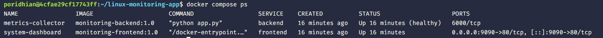
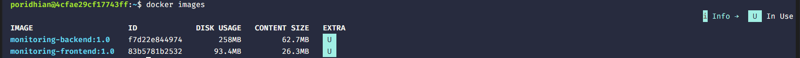
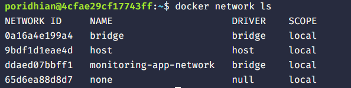
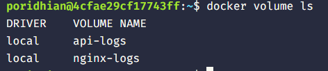

# Linux Monitoring App

A small monitoring stack that collects system metrics and serves a lightweight dashboard.


**Project Structure**

```
linux-monitoring-app/
	docker-compose.yaml
	readme.md
	metrics-collector/
		app.py
		Dockerfile
		requirements.txt
	system-dashboard/
		Dockerfile
		index.html
		nginx.conf
```

**Screenshots**

System Dashboard

List of currently running containers 



List of images



List of networks



List of volumes



**Overview**
- `metrics-collector`: Python collector service that gathers system metrics and runs as the backend.
- `system-dashboard`: Static dashboard served by Nginx (frontend).
- `docker-compose.yaml`: Orchestrates the services, networks, and volumes.

**Prerequisites**
- Docker
- Docker Compose

**Quick Start (development)**
Build and start services:

```bash
docker-compose up --build
```

Open the dashboard in your browser: http://localhost:9090

**Services (from compose)**
- `frontend` (container: `system-dashboard`) — Nginx serving the UI on host port 9090.
- `backend` (container: `metrics-collector`) — collector process (Python).

**Logs & Persistence**
- Nginx logs: Docker volume `nginx-logs`.
- API/collector logs: Docker volume `api-logs`.

**Development notes**
- Rebuild backend only: `docker-compose build backend && docker-compose up backend`.
- Rebuild frontend only: `docker-compose build frontend && docker-compose up frontend`.

**Files to inspect**
- Collector entrypoint: [metrics-collector/app.py](metrics-collector/app.py)
- Frontend static site: [system-dashboard/index.html](system-dashboard/index.html)
- Docker configuration: [docker-compose.yaml](docker-compose.yaml)

**Q&A**
- What is the difference between a Docker image and a container?
- What does 9090:80 mean?
- Why do containers need a Docker network?
- Why do we use Docker volumes?
- What problem does Docker Compose solve?
- Add a restart policy to the services and explain what it does.


